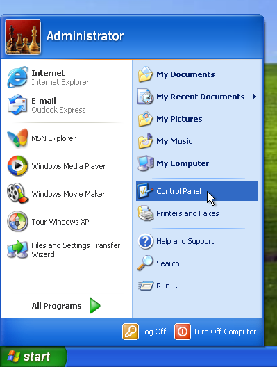
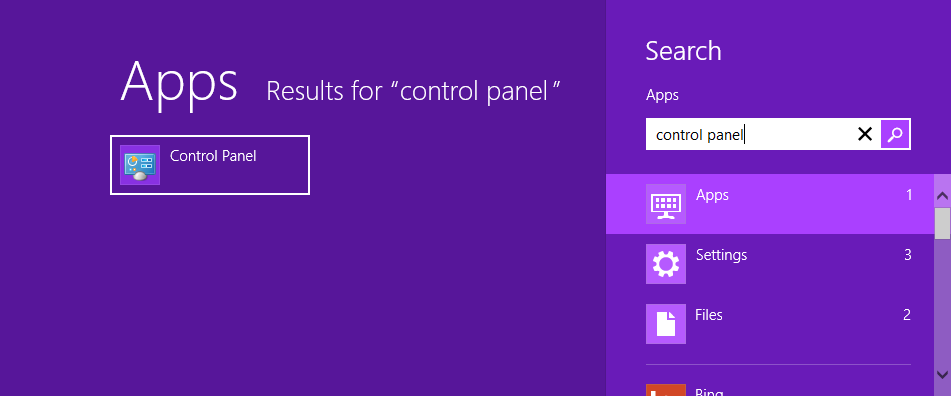
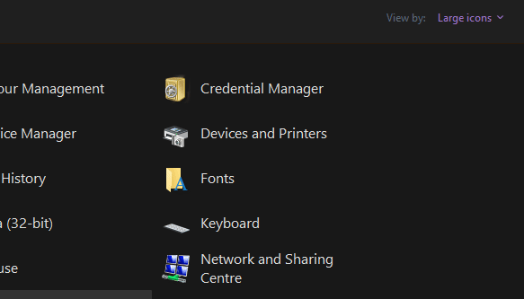
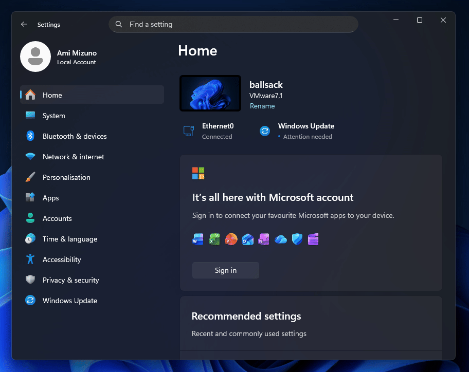

# WiiNite v0.0.3 - by TheYellowPolarBear & ByteOfMelon
 
> [!WARNING] 
> WiiNite is still incredibly early in development and currently lacks much of its expanded functionality.

[Uses lshachar's WiimoteLib DLL  ](https://github.com/lshachar/WiimoteLib) 
[Uses the 32Feet.NET bluetooth DLL](http://32feet.codeplex.com) 
[Uses vJoy device driver (by Shaul Eizikovich)]( http://vjoystick.sourceforge.net/) 
(Previous to  WiiBalanceMaker v0.5 [VJoy by headsoft](http://headsoft.com.au/index.php?category=vjoy) was used) 

WiiNite is a fork of [WiiBalanceMaker](https://github.com/lshachar/WiiBalanceWalker) that intends to give the user additional customisation with what controls they can map to their Wii Balance Board. This is including, but not limited to, custom gesture control and key maps based on specific balance ratios.

This is a project intended for an upcoming [TheYellowPolarBear](https://www.youtube.com/theyellowpolarbear) video. A very special thanks to [ByteOfMelon](https://github.com/ByteOfMelon) for his significant contributions to this project.

***

### WiiNite v0.0.3 changelog:
- Added support for 32-bit operating systems, including Windows XP SP3
- Cleaned the 'Add/Remove bluetooth Wii Device' form's UI
- Cleaned some file names
- Added an NT OS version checker to make getting to the relevant Bluetooth pairing settings easier

### WiiNite v0.0.2 changelog:
- Fixed a bug that made the startup options revert to their defaults after connecting to a Wii Balance Board
- Removed redundant features in the 'Add/Remove bluetooth Wii Device' form

### WiiNite v0.0.1 progress over WiiBalanceMaker v0.5:
- Fixed jump functionality to add cooldown

### To-Do List
#### High Priority
- [ ] Corner assingment
- [ ] Balance ratio/threshold assignment (i.e., center balance assignment)
- [ ] Live visual sensor display
- [ ] Gesture control
- [ ] Profiles
- [ ] Improve mouse mapping
- [ ] Improve key assignment process
  - [ ] Potentially a visual mapper?
- [ ] UI improvements (to be expanded on)
  - [ ] Make it suitable for 800x600 displays?
- [x] Windows XP/32-bit compatibility
- [ ] Combination input support

#### Low Priority/To Be Considered
- [ ] Hold/tap distinction

### System Requirements

WiiNite runs on the .NET Framework 4.0 and hence supports everything from (2008) Windows XP SP3 onwards.

*(spoiler alert: you will also need a Wii Balance Board and a Bluetooth-supported motherboard or adapter)*

### Wii Balance Board Pairing
> [!WARNING]
> Please ensure you use the Control Panel rather than the Settings app to pair your Wii Balance Board. Both methods will prompt you to enter a password; the password is actually empty and only the Devices and Printers/Bluetooth menu in the Control Panel will allow you enter a blank password.

#### Windows XP and Vista
Both operating systems only have the Control Panel. Select the *Bluetooth Devices* settings via the Classic View.

#### Windows 7
Use *Devices and Printers* in the Control Panel.

#### Windows 8, 8.1, and 10

*Devices and Printers* is still easily accessible within Windows 8.x, just search for the Control Panel in the charms bar. Alternatively, you can search for *Devices and Printers* directly, but you will need to select the Settings filter.

In early versions of Windows 10, you can search for *Devices and Printers* directly in the search bar, but later versions require you to go through the Control Panel.

#### Windows 11
##### Method 1
Access *Devices and Printers* in the Control Panel, right-click on it, and click *Open in new window*

##### Method 2
Go to Settings -> Bluetooth -> Devices (don't click Add device) -> More devices and printer settings

